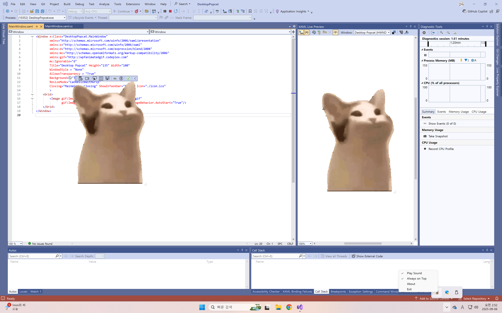

# Desktop Popcat

A simple and fun WPF application that displays an animated **Popcat** on your Windows desktop.  
Bring the internet’s favorite meme directly onto your workspace!  

<p align="center">
  
</p>

## Getting Started

### Prerequisites
- Windows 10/11
- [.NET Framework 4.8.1](https://dotnet.microsoft.com/en-us/download/dotnet-framework/net481)

### Installation with Provided Installer
1. Download [setup.exe](setup.exe). You can also find it from [Releases](https://github.com/miniprime1/DesktopPopcat/releases/tag/1.0.0).  

2. Install Desktop Popcat using the installer [setup.exe](setup.exe).


## Build from Source Code

### Requirements
- Windows 10/11
- [Visual Studio 2022](https://visualstudio.microsoft.com/vs/) (or newer)
- [.NET Framework 4.8.1 SDK](https://dotnet.microsoft.com/en-us/download/dotnet-framework/net481)

### Build using Visual Studio
1. Clone the repository:
   ```bash
   git clone https://github.com/miniprime1/DesktopPopcat
   ```

2. Open the solution file [DesktopPopcat.sln](DesktopPopcat/DesktopPopcat.sln) in Visual Studio.

3. Build solution, then the compiled binary will be located in: [DesktopPopcat/DesktopPopcat/bin/Debug/](DesktopPopcat/DesktopPopcat/bin/Debug/)

## License

[MIT License](license.txt)

